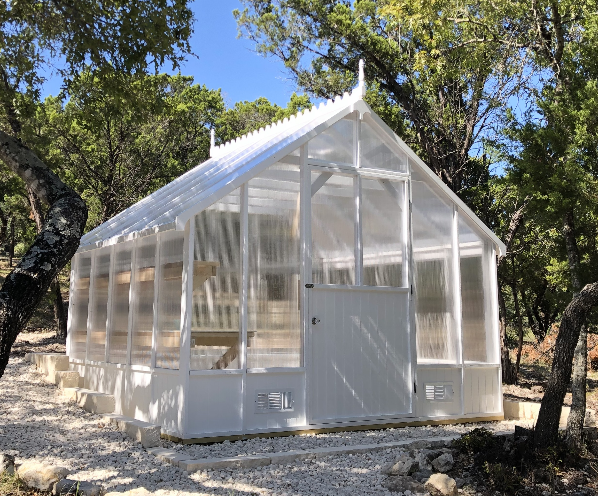

# Greenhouse Plans
-----------------------------------------------------------------------------------

	

# Introduction

I have built and seen many greenhouses over the years.  Most of them fail because the panels are screwed into the frame of the structure providing a pathway for moisture and rot.  [This new design](https://github.com/pfroysdon/projects/blob/main/musings/greenhouse/Greenhouse%20Build%20Instructions%20v2.pdf) uses a floating panel method that avoids external screws thereby protecting the wood structure from rot and premature deterioration.  My greenhouse is has weathered 7 winters and summers in Texas without any issues, and there are 6 other greenhouses built in the same region of the Texas Hill Country using these plans.  The build requires material that can be purchased from Home Depot and you can build it with common and inexpensive woodworking tools.

I hope you enjoy this greenhouse.

